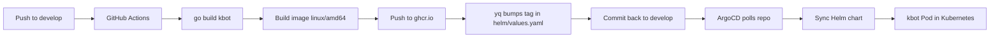

# kbot

# kbot

Telegram-бот на Go. Cobra + telebot.v4.

Бот: t.me/prometheus_kbot_bot

## Что умеет

- `/start` — здоровается
- `/help` — показывает список команд
- на любой текст отвечает эхом

## Как запустить

```bash
git clone https://github.com/ArturSkrin/kbot.git
cd kbot
go mod tidy
```

Создай `.env` и впиши туда токен от @BotFather:

## CI/CD Pipeline

